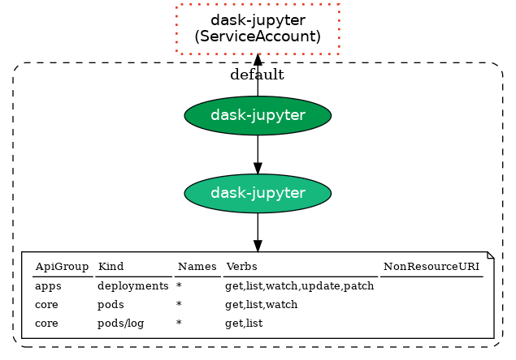

Kubeflow RBAC

- kubeflow-edit clusterrole is an aggregation over multiple other roles (see https://github.com/kubeflow/manifests/blob/master/common/kubeflow-roles/base/cluster-roles.yaml#L15-L25)
- https://github.com/StatCan/aaw-kubeflow-manifests/blob/aaw-dev-cc-00/kustomize/common/kubeflow-roles/base/kustomization.yaml Kubeflow roles are deployed here
-

E.g. generate the RBAC dag for `default-editor` service account in the `collin-brown` namespace with `rbac-tool` as follows:

```bash
rbac-tool viz --include-subjects="default-editor" --include-namespaces="collin-brown" --show-psp=false --outformat dot && cat rbac.dot | dot -Tpng > rbac.png
```

Navigating RBAC in general

E.g. the following snippet produces a simple RBAC diagram (note: the `dask-jupyter` service account doesn't exist on the AAW - it is just shown below for illustrative purposes):

```bash
rbac-tool viz --include-subjects="dask-jupyter" --outformat dot && cat rbac.dot | dot -Tpng > rbac.png
```



rbac-tool program and K8s RBAC utilities - see https://www.freshbrewed.science/k8s-and-krew-rbac-utilities/index.html RBAC Utilities

